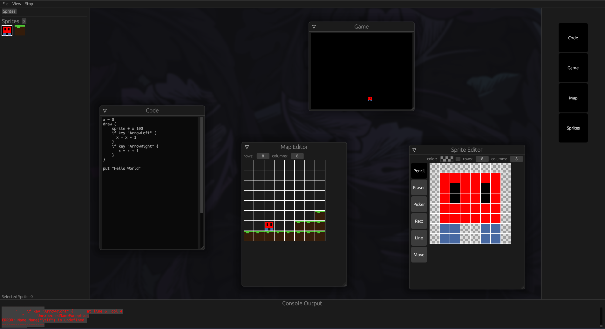

# fan-z
This was an experiment in making a "fantasy console" game engine inspired by pico-8 and the like. It uses rust and my own toy language, [zsp](https://github.com/CoolElectronics/zsp)

Includes a bundled sprite, code, and map editor typical of any fantasy console.

This is NOT a finished project, nor one that will ever be finished. It's a fun experiment I tried out and an example of zsp's usage, although it's not a very functional language.

It theoretically would compile to webassembly.

If you want to try it out yourself for some reason, clone the project and "cargo run" as you normally would. Again, there's no documentation so you won't have a great time.

